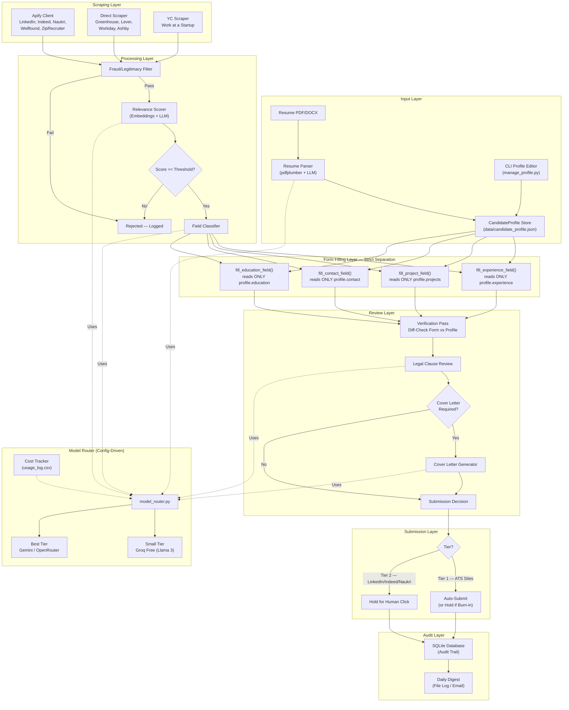
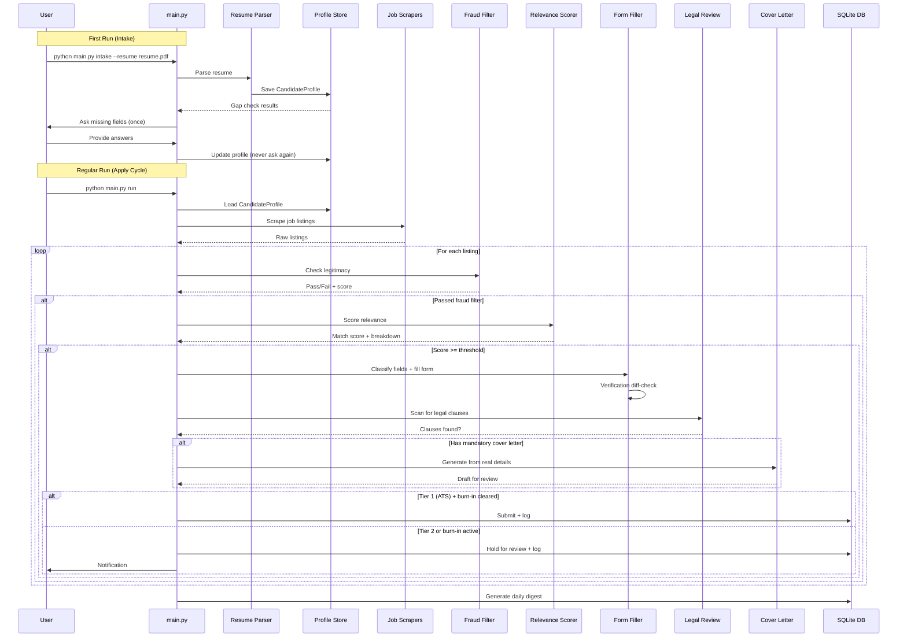
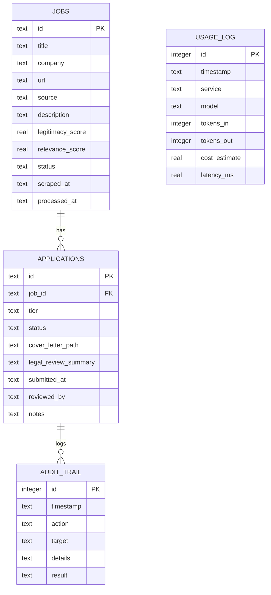

# Project Architecture — Agentic-JobApply-Companion

## System Architecture Overview

---

## Data Flow

---

## Component Responsibilities

### Input Layer

| Component | File | Responsibility |
|---|---|---|
| Resume Parser | `backend/parsing/resume_parser.py` | Extract text from PDF/DOCX, LLM-structured extraction to `CandidateProfile`, one-time gap check |
| Profile Schema | `backend/parsing/profile_schema.py` | Pydantic models with strict typing — `Experience`, `Project`, `ContactInfo` are structurally separate |
| Profile Store | `backend/parsing/profile_store.py` | Load/save profile JSON, gap detection, merge without overwrite, version backup |
| Profile Manager | `manage_profile.py` | CLI for viewing, editing, exporting, and validating the stored profile |

### Model Router

| Component | File | Responsibility |
|---|---|---|
| Model Router | `backend/model_router.py` | Config-driven LLM routing: task tier → provider + model, fallback chains, retry with backoff |
| Model Config | `config/model_config.yaml` | Editable tier-to-model mapping — swap providers without code changes |
| Cost Tracker | `backend/cost_tracker.py` | Log every LLM call (model, tokens, latency, cost) and Apify run (compute units) |

### Scraping Layer

| Component | File | Responsibility |
|---|---|---|
| Base Scraper | `backend/scrapers/base_scraper.py` | Abstract base with retry, rate-limiting, error handling |
| Apify Scraper | `backend/scrapers/apify_scraper.py` | LinkedIn, Indeed, Naukri, Wellfound, ZipRecruiter via Apify marketplace actors |
| ATS Scraper | `backend/scrapers/ats_scraper.py` | Direct scraping for Greenhouse, Lever, Ashby; Playwright for Workday |
| YC Scraper | `backend/scrapers/yc_scraper.py` | Y Combinator Work at a Startup board |
| Job Schema | `backend/scrapers/job_schema.py` | `RawJobListing`, `ProcessedJobListing` Pydantic models |
| Scraper Registry | `backend/scrapers/scraper_registry.py` | Register and run scrapers by platform |

### Processing Layer

| Component | File | Responsibility |
|---|---|---|
| Fraud Filter | `backend/fraud_filter/filter.py` | Hard-blocker checks (deterministic) + soft-signal scoring (weighted) |
| Signal Checkers | `backend/fraud_filter/signals.py` | Individual checkers: company LinkedIn, Glassdoor, salary reasonableness, urgency language |
| Relevance Scorer | `backend/matching/scorer.py` | Embedding similarity + LLM-augmented scoring, configurable thresholds |
| Vector Store | `backend/matching/vector_store.py` | ChromaDB wrapper for job embeddings, deduplication |
| Embeddings | `backend/matching/embeddings.py` | sentence-transformers embedding generation |

### Form Filling Layer

| Component | File | Responsibility |
|---|---|---|
| Field Classifier | `backend/form_filler/field_classifier.py` | Extract label + context → LLM classify → route to typed filler |
| Filler | `backend/form_filler/filler.py` | Structurally separate fill functions per data type — zero cross-contamination |
| Verification | `backend/form_filler/verification.py` | Pre-submission diff-check: form contents vs profile data |
| Dropdown Handler | `backend/form_filler/dropdown_handler.py` | Duration/year-bucket selection logic |
| ATS Handlers | `backend/form_filler/ats_handlers/` | Greenhouse, Lever, Workday, Ashby, Generic adapters |

### Review Layer

| Component | File | Responsibility |
|---|---|---|
| Cover Letter | `backend/cover_letter/generator.py` | Mandatory-only trigger, real-detail specificity, ban-list enforcement |
| Ban List | `backend/cover_letter/ban_list.py` | Stock AI phrase detection + rejection |
| Legal Reviewer | `backend/legal_review/reviewer.py` | Clause extraction, plain-language summary, consent detection |
| Clause Patterns | `backend/legal_review/clause_patterns.py` | Regex + keyword patterns for legal terms |

### Orchestration Layer

| Component | File | Responsibility |
|---|---|---|
| Pipeline | `backend/pipeline.py` | Full orchestration: scrape → filter → score → fill → review → submit/hold |
| Database | `backend/database.py` | SQLite wrapper: applications, jobs, usage, audit tables with migrations |
| Digest | `backend/digest.py` | Daily activity summary generation |
| Main CLI | `main.py` | Entry point: `intake`, `run`, `status`, `review` subcommands |
| Scheduler | `schedule.py` | Cron-based scheduling for Tier 1 auto-apply |

---

## Database Schema

---

## Security Model

- **Secrets**: All API keys in `.env`, never committed, loaded via `python-dotenv`
- **PII**: Candidate profile and scraped data in `data/` (gitignored), never committed
- **Legal**: All consent/legal checkboxes require explicit human action — no auto-acceptance
- **Audit**: Every action logged with timestamp, target, and result for traceability
- **Platform Safety**: LinkedIn/Indeed/Naukri always require human click to avoid account bans
